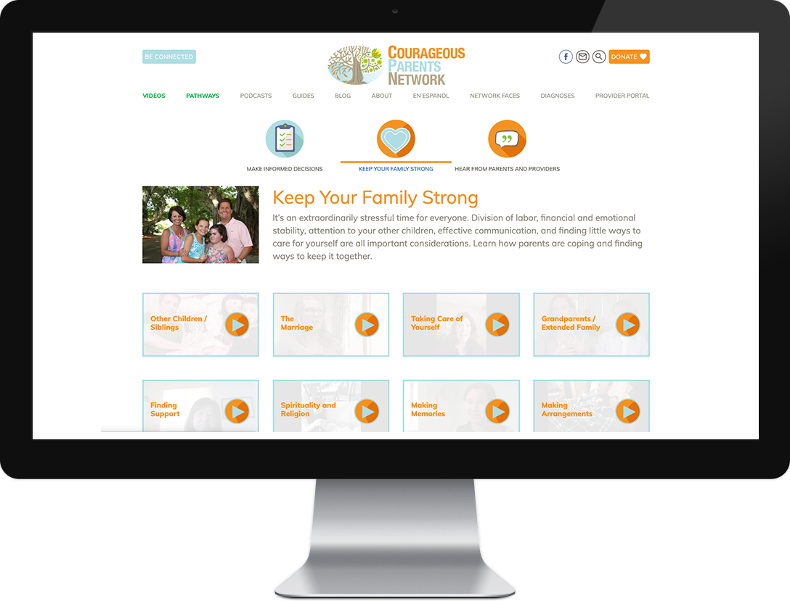
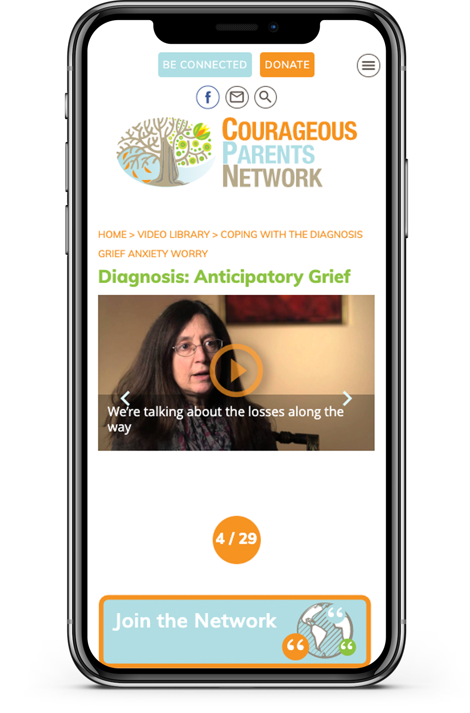
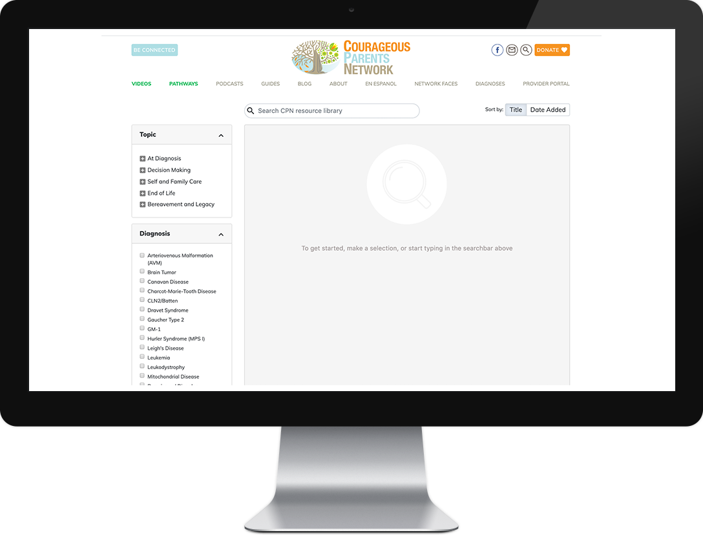

---

## Overview

- React
- Redux
- Typescript
- SSR
- Redux First Router
- Express
- Auth0
- 'Headless' WordPress Content Server

---

Courageous Parents Network is a non-profit organization with the mission of empowering parents caring for children with serious illness through video, shared community, professional guidance, and palliative care.

  

I was first contracted by Courageous Parents Network to create a WordPress site in 2013 to showcase the organization's growing video library. After numerous updates, a rebuild, and much growth of the organization, we decided to rebuild the platform in react.

  

I transformed the organization's Wordpress backend into a highly optimized API server, keeping all of the familiarity and functionality of wordpress while catering to the data-fetching demands of the new redux stores.  

I created a highly optimized search facet feature which allows users to effectively and quickly search through hundreds of videos and other assets.

  

