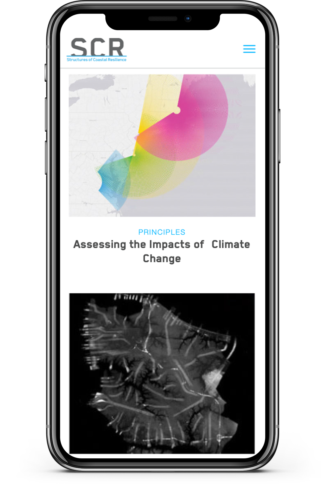
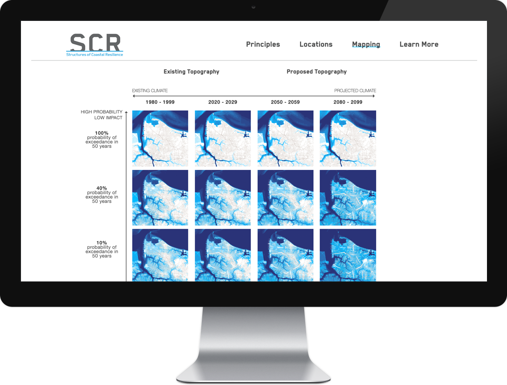
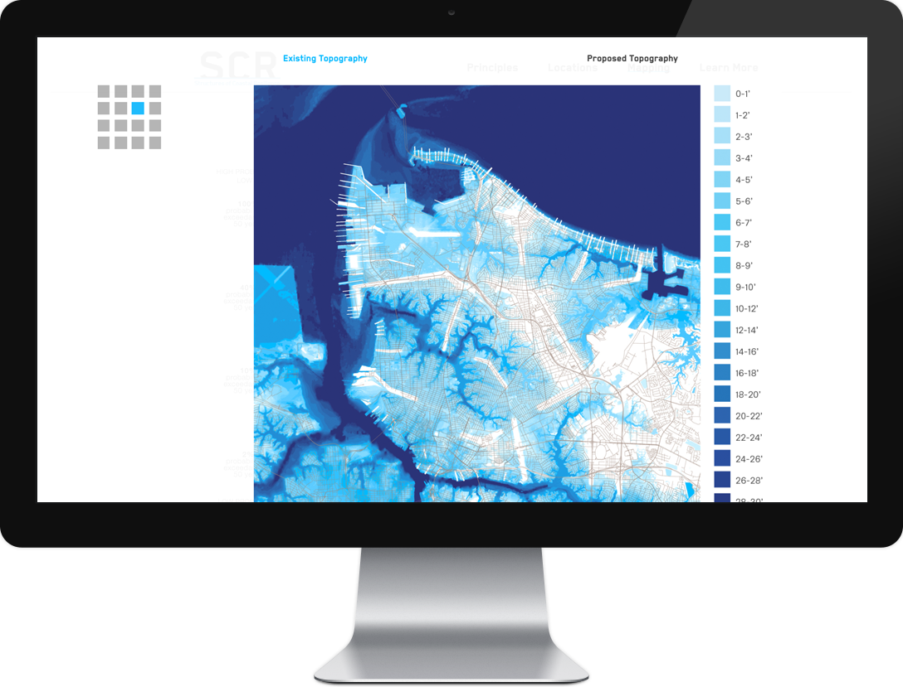

---

## Overview

- Custom Wordpress theme, built on Roots
- Custom Javascript functionality

---

 
I partnered with Pentagram design to create a new homepage layout and custom mapping matrices for this organization, whose mission is to provide specific and actionable project recommendations for hurricane protection and climate adaptation. 

  

  

  

