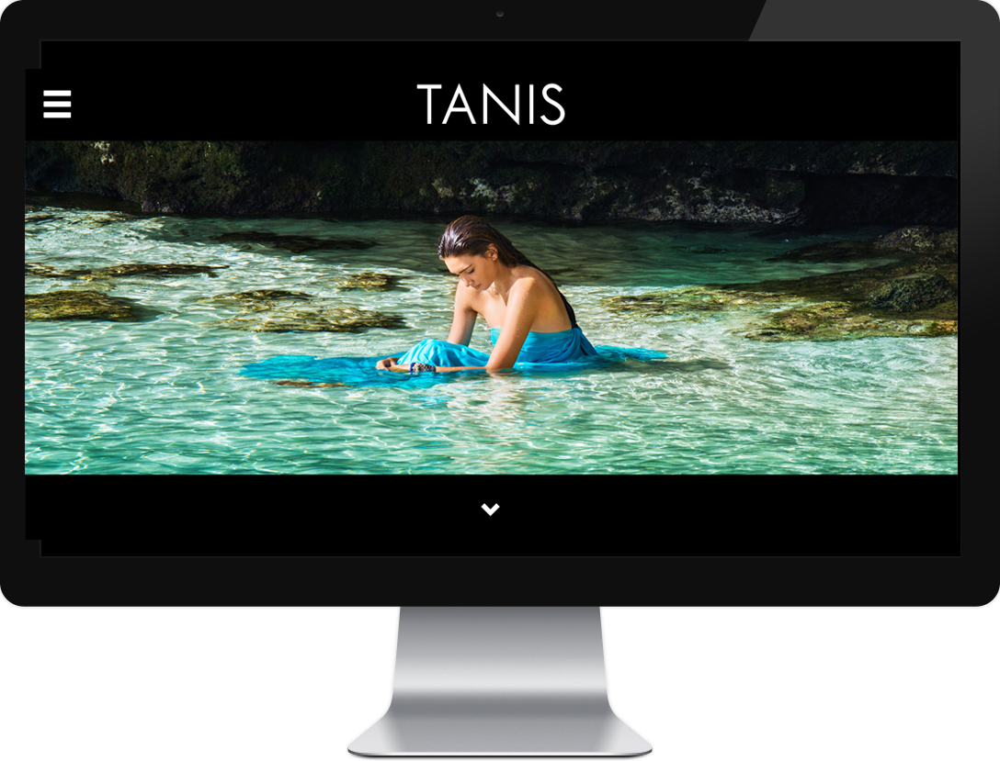
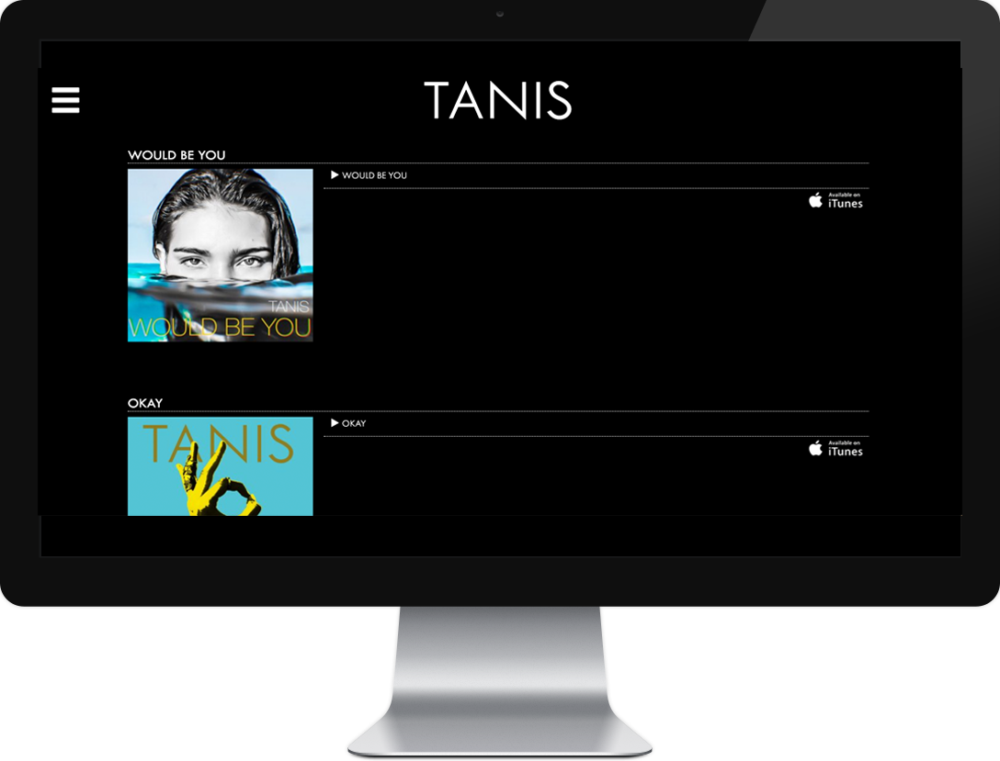
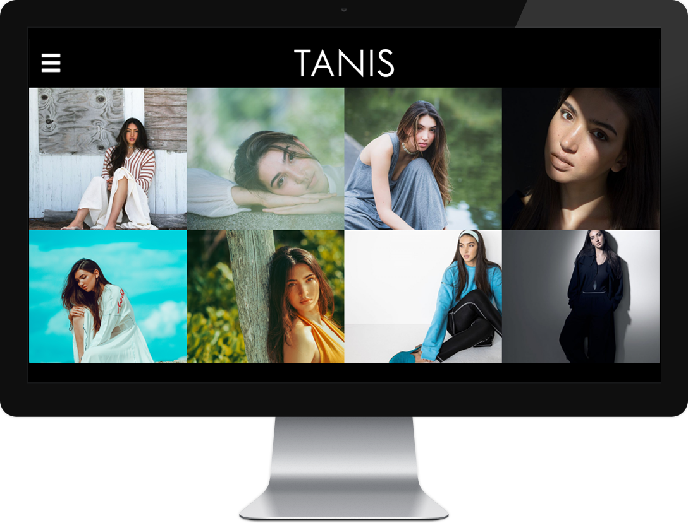

---

## Overview

- Roots-Trellis based optimized Wordpress infrastructure
- Custom theme built with Sage
- Laravel Blade Templates
- Custom integrated audio player
- French Language translations throughout

---

I created a new web site for the remarkable musician and composer, Tanis Chalopin, to showcase her new releases and composition work in film and TV.

  

This site featured custom audio and video players to quickly and effortlessly showcase the Amazon Cloudfront hosted audio and video content 

  

    
  

  

    
  

  

    
  
 

